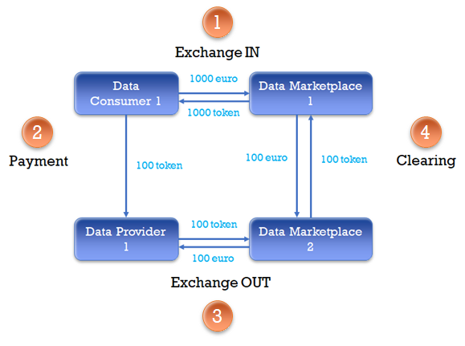
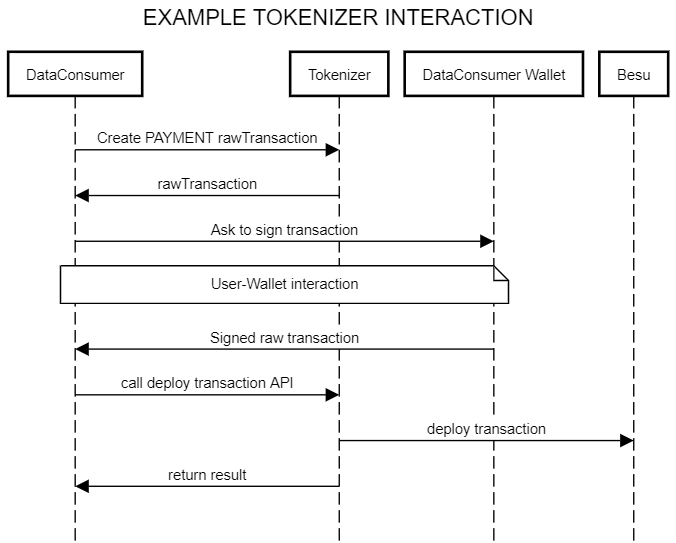

# Tokenization Treasury API
[](LICENCE.md)

The tokenization microservice allow the interaction with the I3Market Treasury Smart contract and the implementation of the I3market token flow. 


The flow is divided in four operation:
#### EXCHANGE IN:
The exchange in method must be called by a Data Marketplace, which issues and transfers the right amount of token (of its token type) to the user who pays in fiat money
### PAYMENT: 
The payment method should transfer the right amount of token from the token types available in the Data Consumer balance, to the Data Provider in exchange of some data
### EXCHANGE OUT:
The exchange out method should transfer the right amount of token, from the token available in the Data Provider balance to a data Marketplace in the network in exchange of fiat money
### CLEARING:
A Data Marketplace can clear the tokens distributed by the other Data Marketplace from its balance

An I3Market user can interact with these operation calling the tokenizer. However, the tokenizer cannot directly sign the transactions, so it needs the I3Market wallet to let users sign and then send a transactions that change the status of the blockchain.



Each call to a treasury smart contract method that writes something on the blockchain (POST endpoint) needs two api:
1. an API to create the raw transaction for the method that the user want to call  (ex. PAyment, Exchange_IN ..)
2. an API to send the raw transaction, previously signed by the I3Market wallet, to the blockchain. 


## Getting started / Use

To use the tokenization subsystem and deploy a transaction to Besu you need to follow the next step:
1. Use the [/treasury/marketplaces](http://localhost:3001/api-docs/#/TokenizerController/post_api_v1_treasury_marketplaces) to register a marketplace. In the "senderAddress" and "marketplaceAddress" provide the same address of the marketplace you want to register.
2. Use the [/transactions/exchange-in](http://localhost:3001/api-docs/#/TokenizerController/post_api_v1_treasury_transactions_exchange_in). The request body should have a "senderAddress" which should be a registered markeplace, a "userAddress" and the tokens that you want to exchange.
3. To deploy the transaction to Besu you need to first sign it via i3Market Wallet. After sing and receive the Signature use the [/transactions/deploy-transaction-transaction](http://localhost:3001/api-docs/#/TokenizerController/post_api_v1_treasury_transactions_deploy_signed_transaction) to deploy it. If successful you can check the deployed transaction here [Ethereum Lite Explorer](http://95.211.3.244:8547/)

## How to build, install, or deploy it

### Requirements
NodeJS\
npm\
Git\
Docker

### Run with npm
Clone the project\
Configure the .env file\
```npm install```\
```npm start```
### Run with docker
```bash
$ docker build -t i3-treasury .
$ docker run --name treasury -p 3001:3001 -e ETH_HOST='{EthereumChainWebsocketHost}' -e CONTRACT_ADDRESS='{CONTRACT_ADDRESS}' -e WEBHOOK='{WEBHOOK}' -e PORT=3001 i3-treasury
```


The OAS documentation can be accessed [here](http://localhost:3001/api-docs/)

## Credits

Luca Marangoni Luca.Marangoni@gft.com\
Vangelis Giannakosian vangelis@telesto.gr\
Dimitris Kokolakis dkokolakis@telesto.gr

## Contributing

Pull requests are always appreciated.
